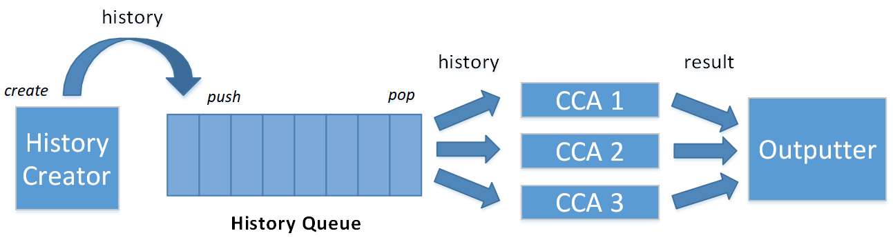
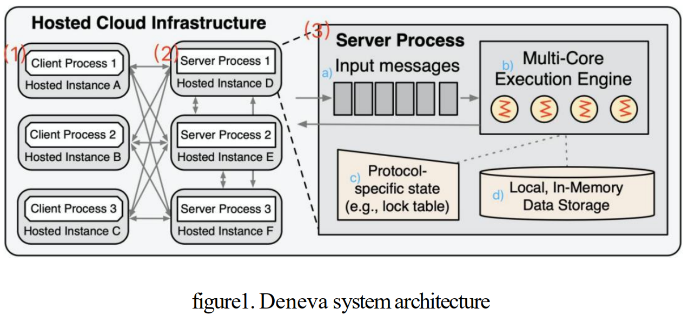
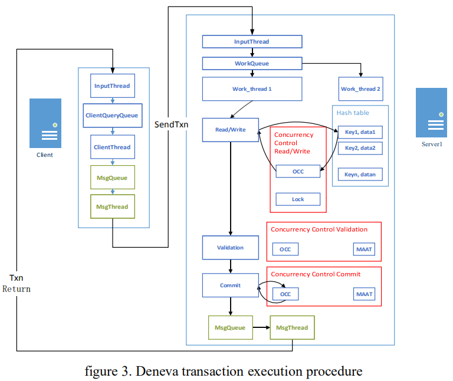
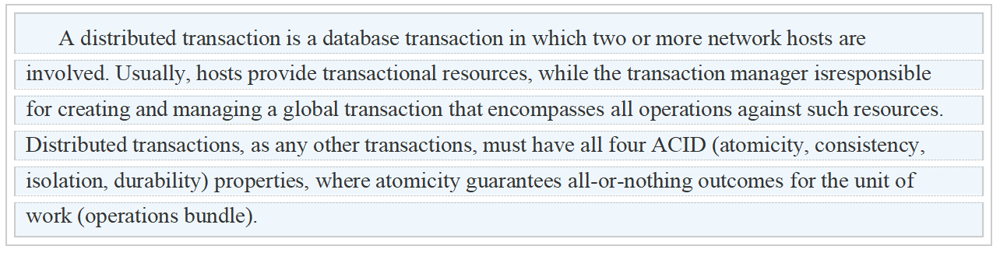
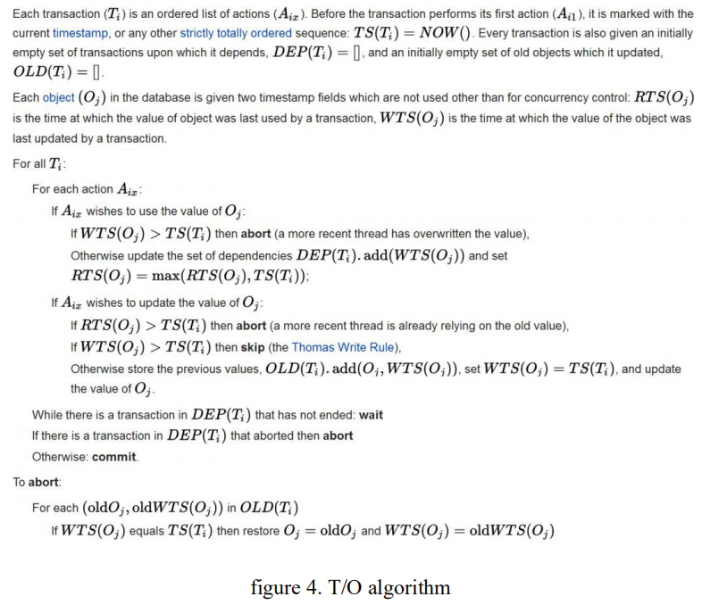

# 3TS Tencent Transaction Processing Testbed System(Part I)		

###### Author: Haixiang Li, Translator: Jingyao Li

​     Tencent Transaction Processing Testbed System (3TS) is a **database transaction processing-oriented testbed system** jointly developed by the TDSQL team of Tencent and the Key Laboratory of Data Engineering and Knowledge Engineering of Renmin University of China. The system aims to facilitate users’ quickly building of a new concurrency control algorithm through designing and building a unified framework for transaction processing(including distributed transactions), and through the accessible API provided by the framework. By using the testbed provided by the system, it is convenient for users to impartially compare the performance of mainstream concurrency control algorithms in the same test environment, and select an optimal concurrency control algorithm according to the needs of specific application scenarios. By far, the verification system has integrated 13 different kinds of mainstream concurrent control algorithms and common benchmarks such as TPC-C, Sysbench and YCSB. In addition, 3TS further provides a consistency level benchmark to determine the level of consistency and compare result of performance test in face of the difficult system selection problem created by the rapid development of distributed database system nowadays. 

​     3TS system aims at exploring the theories and implementation technologies related to database transaction processing in depth, with core concepts as **openness, deepness and evolution**. Openness is to share knowledge and technology while insisting on open source coding. Deepness requires incisive study of the fundamental problem in transaction processing technology with a spirit of systematic lucubration. Evolution stands for endless pursuit and constant explore along the long way of ascetic practices. 

## 1. 3TS Overall Description

​     As a framework of transaction processing technology, 3TS is committed to exploring essential issues including:

1. How many kinds of data anomalies exist? How to establish systematic research method of data anomalies?
2. Why exist different kinds of concurrent access control algorithms? Among them, is there any essential correlation?
3. After the transactional database changes from single-machine to distributed, which aspects will be affected?(availability? Reliability? Security? Consistency? Scalability? Function? Performance? Architecture? . . . )
4. What new technologies will affect and how will they affect distributed transactional database systems?
5. How should the evaluation system of distributed transactional database system be established?

​     For each of above research problems, corresponding subsystems exist at code level. Such as 3TS-DA subsystem and 3TS-Deneva subsystem open sourced earlier.

## 2. 3TS-DA, Data Anomaly Subsystem

​     3TS-DA Data anomaly subsystem, located in path src/3ts/da, has a project architecture as follows:

1. History Creator: responsible for generating history and exporting it to the algorithm for verification.
2. CCA Group: CCA(Concurrent access control algorithm) can perform anomaly detection on incoming history and return anomaly detection results. 
3. Outputter: export anomaly detection results of current history obtained by different CCA to the output file. 

**Current functions of the 3TS-DA subsystem:**

1. **Test data generation:** support three generation modes of history, including traversal generation, random generation and reading from text. 
2. **Algorithm addition:** provides a unified algorithm interface, which can easily add new concurrent algorithms. At the same time, the framework itself has a variety of built-in algorithms, including: **Serializable, Conflict-serializable, SSI, WSI, BOCC, FOCC, etc.**
3. **Test indicators:** the framework provides a variety of test indicators, including: algorithm rollback rate, true rollback rate, fake rollback rate, execution time, etc. 
4. **Anomaly extension:** The framework implements data anomaly extension algorithm, which can generate unlimited data anomaly histories for the test of the algorithm. 

## 3. 3TS-Deneva, Concurrent Algorithm Framework

​     Devena[1] is a evaluation framework of distributed in-memory database concurrent access control algorithm open sourced by MIT, the original project can be found at https://github.com/mitdbg/deneva. It can study the performance characteristics of concurrency control protocol in a controlled environment. Mainstream algorithms such as **Maat, OCC, TO, Locking(No Wait, WaitDie), Calvin** are provided in this framework. 3TS-Deneva is Tencent's improvement on the original Deneva system, including improvement in multiple aspects. At the algorithm level, more concurrent access control algorithms are added, including: **Serializable, Conflict-serializable, SSI, WSI, BOCC, FOCC, Sundial, Silo, etc.** 

###  3.1 Infrastructure

​     Devena uses a custom engine and some other settings to deploy and implement different concurrency control protocols on the platform, so as to make an assessment as fair as possible. The architecture of the system, as shown in Figure 1, mainly includes two modules:

1. Client instance, which acts as the initiator of the transaction. Each thread in the client is responsible for initiating the transaction request, puts the initiated transaction request into the MsgQueue, and sends it to the server in sequence for specific execution. The client and server instances exhibit fully connected topology, and are generally deployed on different machines. 

2. Server instance, which performs various operations in the transaction. Data stored in different server instances is indexed using consistent hash, so as to form a global partition mapping table between server IP and stored data. By ensuring non-modifiability of partition mapping during test period, availability of this mapping table to all nodes is guaranteed. The communication between client and server, server and server instances use TCP/IP protocol. Each server instance can be internally subdivided into four modules: 

   1. Input message queue, which stores messages sent by clients/other servers temporarily. 
   2. Execution engine, which allocates multiple worker threads to parse and execute messages in the message queue, using a resource scheduling method of binding one thread with one core.
   3. Concurrency control module. While a worker thread is executing transactions operations, it shall maintain information required by specific concurrency control protocol as well as conform to the procedure stipulated by the protocol, so as to guarantee the effectiveness of the specified concurrency control protocol. 
   4. Data storage module, which is responsible for managing the data in this instance and keeping data in memory. 

   

​     In 3TS, Deneva is improved, with the improved code located in path contrib/deneva and its internal project architecture as follows:

- Deneva has two types of node: server and client.  

- Client generate workload query and send it to server, while server executes the workload query received from client in coordination. 

- Modules shared by client and server:

  ◼ MsgQueue: message queue, store the *msg* to send. 

  ◼ MsgThread: message sending thread, take and send *msg* from MsgQueue in loop. 

  ◼ InputThread: message receiving thread, receive *msg* from server/client. 

- Exclusive module owned by client:

  ◼ ClientQueryQueue: query queue in client, store query lists generated before test begin. 

  ◼ ClientThread: take out *msg* from ClientQueryQueue in loop, and send it to server by MsgThread and MsgQueue. 

- Exclusive module owned by server:

  ◼ WorkQueue: message queue to be processed in server, stores *msg* received by InputThread. 

  ◼ WorkThread: execution thread in server, take *msg* from WorkQueue and process. Generate return *msg* after execution, which will be send by MsgThread and MsgQueue as well. 

### 3.2 Transaction execution procedure

​     In Deneva, as shown in Figure 3, the execution procedure of a transaction can be described as:

1. Client initiates a transaction request composed of multiple operations, and put it in the ClientQueryQueue. ClientThread take out the transaction request from the queue and store it in the MsgQueue. Afterwards, one transaction request is taken out from the MsgQueue, encapsulated as a request and sent to its coordination server by the MsgThread, in which the coordinator is usually chosen as the server with the first visited data. 
2. Server first parses a request after its arriving, and put it in the WorkQueue with all of its operations as one element. New transactions received from client as well as remote pending transactions which have already started exist in the WorkQueue, with the latter has higher priority than the former. The threads in the worker thread pool poll the work queue and process the operations in the transaction. When a worker thread processes the operation of current transaction, it first initializes the transaction, then executes read and write operations in sequence, and finally commits or rolls back. 
   1. In the process of executing a transaction, there are two situations that will cause the transaction to wait. One is to wait for the release of the exclusive lock on a resource; The second is the need to access data in the remote server. When a WAIT is required for remote access to data in another server, the remote server will return a WAIT instruction to the current coordinator node. The coordinator node will temporarily store the WAIT state of the current transaction and schedule the current worker thread to execute other transactions, thus avoiding worker thread blocking. When a waiting transaction is ready to continue, based on a priority scheduling policy implemented by the work queue, it will be continued by the first available worker thread. 
   2. Additional operations required by the concurrency control protocol will be embedded in the transaction execution process, including read and write operations, validation operations, commit/rollback operations, etc. 
3. After the coordination node completes the operation of a certain transaction, it will put the transaction execution result into the MsgQueue, and then the MsgThread will inform the client of the execution result of current transaction. 

## 4. Distributed Transaction Overview

​     Reference [15] identifies distributed transaction as:

​     Distributed transactions base on distributed system to realize the semantic requirements of transaction processing, that is, they must also satisfy ACID characteristics on the distributed system. Therefore, distributed transaction processing of distributed database should also follow the transaction-related theory of stand-alone database system to ensure that each transaction meets the requirements of ACID. Distributed concurrent access control technology is adopted to deal with data anomalies in distributed system and realize distributed transaction’s ACID characteristics. 

​     Basic technology of distributed transaction processing mechanism, is build upon transaction processing mechanism in stand-alone database system. However, there are also some differences, such as how to deal with distributed data anomalies, how to achieve serializability in distributed architecture, how to achieve across-nodes atomic commit, how to shorten transaction response in the presence of network partition or high latency, etc. 

​     Serving as a distributed environment, all these will be implemented and verified in 3TS framework. 

## 5. Concurrent Access Control Algorithms Provided By 3TS

​     By far, 3TS has integrated 13 different kinds of concurrent access control algorithms, mainly including the following:

1. Two-phase locking protocol（2PL: No-Wait, Wait-Die） 
2. Timestamp Ordering Protocol（T/O） 
3. Multi-Version Concurrency Control Protocol（MVCC） 
4. Optimistic Concurrency Control Protocol（OCC、FOCC、BOCC）
5. Optimized Optimistic Concurrency Control Protocol（MaaT、Sundial、Silo） 
6. Deterministic Concurrency Control Protocol（Calvin） 
7. Concurrency control protocol based on snapshot isolation（SSI、WSI）

​     These concurrency control protocols are briefly described below: 

### 5.1 Two-phase locking protocol（2PL）

​     Two-phase Locking protocol（2PL）is the most widely used concurrency control protocol at present. 2PL synchronizes conflicting operations between transactions by acquiring shared locks or exclusive locks when executing read or write operations. According to Bernstein and Goodman [2], 2PL has the following two rules for acquiring locks: 1) No conflicting locks can exist on the same data item at the same time; 2) After a transaction has firstly released a lock, it cannot acquire any locks afterwards. The second rule separates the locking phase of a transaction as two phase: growing phase and shrinking phase. During the growing phase, a transaction acquires locks for all records it needs to access. A shared lock is acquired by a read operation while a write operation acquires a mutex lock. While shared locks do not conflict with each other, conflict exists between mutex and shared locks or multiple mutex locks. Once the transaction releases either of the locks, it will enter the second phase known as shrinking phase in 2PL. After entering into shrinking phase, no new lock is allowed to be acquired for this transaction. 

​     3TS implements the Strict 2PL protocol that does not release locks until the transaction commits or aborts. Depending on how to avoid deadlock, there are two implementations of 2PL in 3TS: 2PL (no-wait) and 2PL (wait-die). The implementations of these two protocols follow the descriptions in [2, 3].

#### 5.1.1 2PL（No-Wait） 

​     2PL(No-Wait) protocol states that when a lock conflict occurs when a transaction tries to lock, the transaction that is currently requesting the lock shall rollback. Any locks held by the rollback transaction will be released, allowing other transactions to acquire the lock. The No_Wait mechanism avoids deadlocks by preventing ring among wait transaction. However, not every lock conflict results in deadlock, therefore the rollback rate can be comparatively high. 

#### 5.1.2 2PL（Wait-Die）

​     Rosenkrantz[3] proposed 2PL(Wait-Die), prioritize transactions by their corresponding start timestamp, so as to ensure lock wait order is consistent with the timestamp order. As long as the transaction timestamp is smaller(older) than any transaction currently holding the lock, the current transaction waits. Otherwise, the current transaction needs to rollback. For any two conflicting transactions *Ti* and *Tj*, the protocol relays on the timestamp priority to decide whether *Ti* should wait for *Tj*. **If *Ti* has a lower priority (smaller timestamp), then *Ti* needs to wait, otherwise *Ti* should rollback. Therefore, no loop in the lock wait graph can exist, thus deadlock can be prevented.** 2PL(Wait-Die) is a combination of TO and locking technology. 

​     However, distributed transaction processing mechanisms based on the principles of 2PL either avoid deadlocks (high rollback rate) or need to solve the problem of deadlocks(resource and communication deadlocks). The cost of resolving deadlocks in a distributed system will be very high (the cost of resolving deadlocks on a single-machine system is already high, and modern database systems based on multi-process or multi-threaded architectures may cause the system to almost stop service. In MySQL version 5. 6 and 5. 7, the same data item is updated concurrently, and the deadlock detection operation may cause the system to almost stop service). 

​     Not only deadlock detection consumes huge resources, but also the disadvantages of the lock mechanism itself have been criticized. Reference [5] believes that the disadvantages of the locking mechanism are as follows (a clear understanding of these disadvantages prompted the author of reference [5] to design OCC, that is, Optimistic Concurrency Control):

1. **The locking mechanism is expensive:** In order to ensure serializability, for read-only transactions that comply with the integrity constraints of the database, read locks needs to be added by the locking protocol to exclude potential concurrent write operations and prevent others from modifying. For locking protocol with possible deadlocks, overhead caused by mechanisms such as deadlock prevention/deadlock detection also needs to be endured. 
2. **The locking mechanism is complex:** In order to avoid deadlocks, various complex locking protocols need to be customized (such as when to lock, when to release lock, how to guarantee strictness, etc. ). 
3. **Reduce the concurrent throughput of the system:**
   1. If a transaction waiting for I/O operation holds locks, the overall concurrent throughput of the system will be greatly reduced. 
   2. Locks must be held by the transaction until the end of transaction rollback, which will also reduce the overall concurrent throughput of the system. 

​     In addition, the use of the lock mechanism for mutually exclusion operations will cause time-consuming kernel-mode operations for the operating system and make the lock mechanism inefficient. This means that the 2PL technology with transaction processing semantics based on the lock mechanism of the operating system is even more unusable (nevertheless, there are also some technologies that are constantly improving the concurrent access control algorithm based on locking protocol). 

### 5.2 Timestamp ordering protocol（T/O） 

​     Timestamp Ordering(T/O) protocol allocates a timestamp at the beginning of a transaction, and sorts the transactions in the order of the timestamp[2]. When the execution of an operation violates the order that has been specified between transactions, corresponding transaction to current operation will rollback or enter a waiting state. 

​     The implementation of the T/O algorithm in 3TS follows the description in Section 4.1 in [2]. You can refer to this document for more details. The following figure shows the implementation of a basic T/O algorithm. 

### 5.3 Multi-version concurrency control protocol（MVCC）

​     Multi-Version Concurrency Control(MVCC) is a concurrent access control technology commonly used in current database management systems. It was first proposed by David Patrick Reed [4] in 1978. The main idea is to expand a logical data item into multiple physical versions, and transaction’s operation on data item is converted to operation on physical versions, thereby improving the concurrency rate of transaction processing, as well as providing the ability to read and write without blocking each other. 

​     The MVCC technology was firstly proposed in 1970, and was further described in 1978 in "Naming and synchronization in a decentralized computer system"[4]. Later, reference [16] described the MVCC technology in detail in 1981, while the MVCC technology it described is based on timestamp.

​     After that, MVCC technology was widely used with multiple versions been developed. 

​     In 2008, reference [13] was published, achieving serializable isolation level based on MVCC by proposing “Serializable Snapshot Isolation” technology. Which makes PostgreSQL V9.1 achieves serializable isolation level by implementing this technology. 

​     In 2012, reference [14] was published, and proposed the “Write-Snapshot Isolation” technology to achieve a serializable isolation level based on MVCC by verifying read-write conflicts. Compared with the method of detecting write-write conflicts, it improves the concurrency rate(a certain kind of write-write conflict can be serializable). The author of this article made a system implementation based on HBase. 

​     In 2012, reference [17] implements SSI technology on PostgreSQL. This article not only tells the theoretical basis of serialized snapshot, PostgreSQL’s implementation technology of SSI, but also proposed important topics such as "Safe Snapshots" and "Deferable Transaction" to support read only transactions, “Safe Retry” strategy to avoid potential effect caused by transaction rollback after read-write conflict, as well as 2PC’s influence on choosing rollback transaction after read-write conflict. 

​     Reference [19] systematically discussed the four aspects involved in MVCC technology, namely: concurrent access control protocol, multi-version storage, old version garbage collection, and index management. In addition, the principle of various variants of MVCC was discussed, and the effect of each variant ( MV2PL , MVOCC, MVTO, etc. ) was tested and evaluated on OLTP workload after their implementation. [18] discussed the old version garbage collection problem of MVCC in detail.

​     In 3TS, MVCC is realized based on the description in Section 4. 3 in [2], combined with T/O algorithm. Therefore, the transaction still uses the start timestamp for sorting. Unlike the traditional T/O algorithm, MVCC uses the feature of multiple versions to reduce the operation waiting overhead in T/O. The operation execution mechanism in MVCC is as follows (use ts to represent the timestamp of the current transaction):

1. Read operation
   1. If *ts* is greater than the timestamp of all transactions in *prereq*, and there is a version in *writehis* (the version chain of current data item) that its *wts* is greater than *ts* and less than *pts*, then the current version can be returned, and the timestamp of the current transaction can be stored into *readhis*. If there is no such timestamp in *writehis*, the timestamp of the current transaction is stored in *readreq*. The main reasons are:
      1. If there is a committed write between the pre-write transaction and the read operation, it means that the data read by the current read operation has been written by the write transaction. As the timestamp order is satisfied, the version can be read;
      2. If the timestamp of the read operation is larger than the timestamp of the current unfinished write transaction, new data should be read, so wait is needed;
   2. Otherwise, the current read operation reads the latest visible version to its timestamp, and stores the timestamp of current transaction in *readreq*. 
2. Write operation
     1. If *ts* is less than the timestamp of all transactions in *readhis*, and there is a timestamp in *writehis* between *rts* and *ts*, data can be pre-written normally. If there is no such timestamp in *writehis*, then current transaction will rollback. 
     2. Temporarily store the current write operation in *prereq_mvcc*;
3. Submit operation
     1. Insert the current transaction timestamp and the new version written into *writehis*;
     2. Delete the write operation of the current transaction from *prereq*;
     3. Continue to execute read transactions that comply with the timestamp ordering in *readreq*;

More concurrent access control algorithms, to be continued. . . 

## Acknowledgement

​     Special thanks to the Tencent TDSQL team and the Key Laboratory of Data Engineering and Knowledge Engineering of Renmin University of China for their support and help in this work, and thank Zhao Zhanhao, Liu Chang, Zhao Hongyao and other students for their contributions to this article. 

## Reference

[1] Rachael Harding, Dana Van Aken, Andrew Pavlo, Michael Stonebraker: An Evaluation of Distributed Concurrency Control. Proc. VLDB Endow. 10(5): 553-564 (2017) 

[2] Philip A. Bernstein, Nathan Goodman: Concurrency Control in Distributed Database Systems. ACM Comput. Surv. 13(2): 185-221 (1981) 

[3] Daniel J. Rosenkrantz, Richard Edwin Stearns, Philip M. Lewis II: System Level Concurrency Control for Distributed Database Systems. ACM Trans. Database Syst. 3(2): 178-198 (1978) 

[4] D. P. Reed. Naming and synchronization in a decentralized computer system. PhD thesis, Massachusetts Institute of Technology, Cambridge, MA, USA, 1978.  

[5] H. T. Kung, John T. Robinson: On Optimistic Methods for Concurrency Control. ACM Trans. Database Syst. 6(2): 213-226 (1981) 

[6] Theo Härder: Observations on optimistic concurrency control schemes. Inf. Syst. 9(2): 111-120 (1984) 

[7] Hatem A. Mahmoud, Vaibhav Arora, Faisal Nawab, Divyakant Agrawal, Amr El Abbadi: MaaT: Effective and scalable coordination of distributed transactions in the cloud. Proc. VLDB Endow. 7(5): 329-340 (2014) 

[8] Xiangyao Yu, Yu Xia, Andrew Pavlo, Daniel Sánchez, Larry Rudolph, Srinivas Devadas: Sundial: Harmonizing Concurrency Control and Caching in a Distributed OLTP Database Management System. Proc. VLDB Endow. 11(10): 1289-1302 (2018) 

[9] Stephen Tu, Wenting Zheng, Eddie Kohler, Barbara Liskov, Samuel Madden: Speedy transactions in multicore in-memory databases. SOSP 2013: 18-32 

[10] Alexander Thomson, Thaddeus Diamond, Shu-Chun Weng, Kun Ren, Philip Shao, Daniel J. Abadi: Calvin: fast distributed transactions for partitioned database systems. SIGMOD Conference 2012: 1-12 

[11] Hal Berenson, Philip A. Bernstein, Jim Gray, Jim Melton, Elizabeth J. O'Neil, Patrick E. O'Neil: A Critique of ANSI SQL Isolation Levels. SIGMOD Conference 1995: 1-10 

[12] Alan D. Fekete, Dimitrios Liarokapis, Elizabeth J. O'Neil, Patrick E. O'Neil, Dennis E. Shasha: Making snapshot isolation serializable. ACM Trans. Database Syst. 30(2): 492-528 (2005) 

[13] Michael J. Cahill, Uwe Röhm, Alan D. Fekete: Serializable isolation for snapshot databases. SIGMOD Conference 2008: 729-738 

[14] Maysam Yabandeh, Daniel Gómez Ferro: A critique of snapshot isolation. EuroSys 2012: 155-168 

[15] https://en.wikipedia.org/wiki/Distributed_transaction 

[16] P. Bernstein, V. Hadzilacos, and N. Goodman. Concurrency Control and Recovery in Database Systems. Addison–Wesley, 1987. 

[17] D. R. Ports and K. Grittner, “Serializable snapshot isolation in postgresql, ” PVLDB, vol. 5, no. 12, pp. 1850–1861, 2012. 

[18] J. Böttcher, et al. , Scalable Garbage Collection for In-Memory MVCC Systems, in VLDB, 2019 

[19] Yingjun Wu, Joy Arulraj, Jiexi Lin, Ran Xian, Andrew Pavlo:An Empirical Evaluation of In-Memory Multi-Version Concurrency Control. Proc. VLDB Endow.  10(7): 781-792 (2017) 

[20] D. Lomet and M. F. Mokbel, “Locking key ranges with unbundled transaction services, ” VLDB, pp. 265–276, 2009. 

[21] Jinwei Guo, Peng Cai, Jiahao Wang, Weining Qian, Aoying Zhou: Adaptive Optimistic Concurrency Control for Heterogeneous Workloads. PVLDB 12(5): 584-596 (2019) 

[22] X. Yu, A. avlo, D. Sanchez, and S. Devadas, “Tictoc: Time traveling optimistic concurrency control, ” in Proceedings of SIGMOD, vol. 8, 2016, pp. 209–220. 

[23] Rudolf Bayer, Klaus Elhardt, Johannes Heigert, Angelika Reiser:Dynamic Timestamp Allocation for Transactions in Database Systems. DDB 1982: 9-20. 