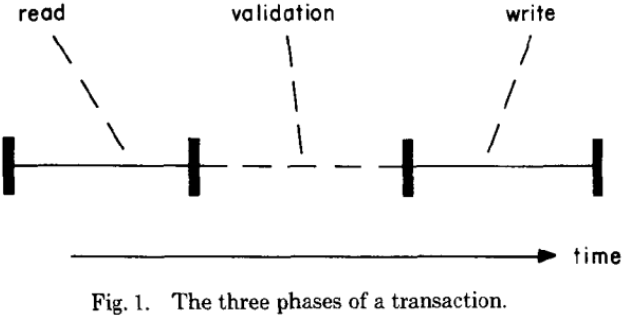

# 3TS Tencent Transaction Processing Testbed System(Part II)		

###### Author: Haixiang Li, Translator: Jingyao Li

​		Tencent Transaction Processing Testbed System (3TS) is a **database transaction processing-oriented testbed system** jointly developed by the TDSQL team of Tencent and the Key Laboratory of Data Engineering and Knowledge Engineering of Renmin University of China. The system aims to facilitate users’ quickly building of a new concurrency control algorithm through designing and building a unified framework for transaction processing(including distributed transactions), and through the accessible API provided by the framework. By using the testbed provided by the system, it is convenient for users to impartially compare the performance of mainstream concurrency control algorithms in the same test environment, and select an optimal concurrency control algorithm according to the needs of specific application scenarios. By far, the validation system has integrated 13 different kinds of mainstream concurrent control algorithms and common benchmarks such as TPC-C, Sysbench and YCSB. In addition, 3TS further provides a consistency level benchmark to determine the level of consistency and compare result of performance test in face of the difficult system selection problem created by the rapid development of distributed database system nowadays. 

​     3TS system aims at exploring the theories and implementation technologies related to database transaction processing in depth, with core concepts as **openness, deepness and evolution**. Openness is to share knowledge and technology while insisting on open source coding. Deepness requires incisive study of the fundamental problem in transaction processing technology with a spirit of systematic lucubration. Evolution stands for endless pursuit and constant explore along the long way of ascetic practices. 

## 5. Concurrent Access Control Algorithm Provided By 3TS

​     Part I introduced the framework and basic content of 3TS. This section continues to introduce a variety of concurrent access control algorithms in depth.

### 5.4 Optimistic concurrency control protocol（OCC、FOCC、BOCC）

​     Under the optimistic concurrency control protocol, the execution procedure of transaction is divided into three phases: read, verify, and write[5], as shown in Figure 5.

​     The advantages brought by the division of these three phases are obvious: 

1. **High transaction processing performance:** The improvement of transaction efficiency is mainly ensured by the non-blocking of reading and writing in the first phase, which greatly improves the concurrency and fully utilizes multi-core hardware resources. It is friendly especially to read-only transactions because of non-blocking read. 

2. **Avoidance of deadlock:** OCC can avoid deadlock by sorting the read and write objects in the first stage and locking in order in the second stage. This wins in comparison with the locking based concurrent access control algorithms in solving the deadlock problem. These two advantages enable OCC to still support high transaction throughput in scenarios such as distributed transactions, high data hotspots, and high communication delays. There is no obvious system performance jitter phenomenon in high concurrency scenarios (reference [169] shows through experiments that OCC algorithm performance is not high under high competition). 

3. **The correctness of data consistency is guaranteed:** the correctness is guaranteed in the validation phase. A directed graph is constructed through the transaction conflict relationship. Through loop detection and transaction rollback, loop-free is ensured to resolve transaction conflicts, while write-write conflicts are prevented through the locking mechanism in validation phase. However, there are different ways to implement in practice. For example, reference [9] improves the OCC algorithm. In the validation phase, it checks the read set of current transaction and rollback if modification by other concurrent transactions is found to avoid data inconsistency. In this way, construction of directed graph and detection of loop is no longer needed. 

   

​     In 3TS, according to different validation mechanisms, three different optimistic concurrency control protocols are implemented: (1) OCC: implementation of Parallel Validation algorithm in [5]; (2) BOCC: implementation of Backward Validation algorithm in [6]; (3) FOCC: implementation of Forward Validation algorithm in [6]. It should be noted that in 3TS, since there is no global timestamp mechanism (global clock will be added according to subsequent plan), the read and write sets that need to be compared in the validation phase may deviate due to clock synchronization, which may result in different degree of efficiency influence concerning different algorithms. 

1. The three protocols deal with the read phase in the same way, mainly:
   1. For read operation, first saved into read set, then reads data as required. 
   2. For write operation, saved into write set. 
2. When it comes to the validation phase, the main idea of all three protocols is to sort transactions according to the order in which they entering the validation phase, then read-write set is checked to ensure the processing results of these transactions meet this order. However, there is a difference in read-write set checking method concerning different protocol. 

#### 5.4.1 OCC 

​     The main procedure of the validation phase is (denote the start timestamp of current transaction to be validated as *start_ts*, the timestamp acquires when entering the validation phase as *finish_ts*):

- Obtain the set of transactions committed in the time period (*start_ts*, *finish_ts*], record it as *History*, traverse the write set of transactions in *History*, if there is an intersection with the read set of current transaction, then the validation fails;
- Obtain the set of transactions currently in validation phase, record it as *Active*, traverse the write set of transactions in *Active*, if there is an intersection with the read set of current transaction, then the validation fails; 

#### 5.4.2 BOCC 

​     The validation phase and the write phase are required to be executed in the same critical region. The process is to obtain the set of transactions submitted in the time period (*start_ts*, *finish_ts*] and record it as *History*. Traverse the write set of transactions in *History*, if there is an intersection with the read set of current transaction, then the validation fails. BOCC has obvious disadvantages, including read-only transactions also need to be validated, large read set of current transaction to be validated has a great impact on validation efficiency, and a large number of write set of committed transactions will need to be retained for long transactions, etc. 

#### 5.4.3 FOCC 

​     The validation phase and the write phase are required to be executed in the same critical region. Traverse the read set of transactions currently in read phase, if there is an intersection with the write set of current transaction, then the validation fails. Compared with BOCC, FOCC has the advantages that read-only transactions can skip the validation phase, and the cost of validation for active transactions is less. 

3. The three protocols deal with the write phase in the same way, mainly: get the submission timestamp, write data in the write set into the database, and set the submission timestamp of the data to the obtained submission timestamp. 

### 5.5 Optimized optimistic concurrency control protocol（MaaT、Sundial、Silo）

​     Traditional optimistic concurrency control protocols determine whether a transaction can be submitted according to the order of validation. Compared with traditional OCC, some optimized optimistic concurrency control protocols relax this requirement and reduce unnecessary rollbacks. Now, there are many improved versions based on OCC, such as ROCC [20], adaptive OCC [21] and so on. 

​     In 3TS, we have integrated three state of the art optimistic concurrency control algorithms, including MaaT, Sunidal and Silo. More concurrent algorithms are expected to be integrated into 3TS. 

#### 5.5.1 MaaT 

​     MaaT [6] uses a dynamic time stamp range adjustment method to reduce the transaction rollback rate. The main idea is to determine the sequence of transactions through the relationship formed in read and write operations among transactions, thereby determining the sequence of transactions in the equivalent serialized sequence. For example, if transaction *Tj* update *x* after transaction *Ti*’s read of *x*, then *Ti* needs to be ranked before *Tj*. 

​     MaaT needs to maintain additional metadata on each data item, including: (1) ID set of Transactions that have read the data item but not yet committed, denote as readers; (2)ID set of Transactions that are about to write the data item but not yet committed, denote as writers; (3)The largest commit timestamp of transactions that has read the data item, record as *Rts*; (4)The largest commit timestamp of transactions that has written the data item, record as *wts*; Each transaction has a timestamp range *[lower, upper)*, and is initialized to *[0, +)*. The procedure of each operation in the transaction mainly includes:

1. Read operation 
   1. Save the write transaction list of the data item to the *uncommitted_writes* of the transaction;
   2. Update current transaction: 
      *greatest_write_timestamp = Max{greatest_write_timestamp, wts}*;
   3. Write the current transaction ID into the read transaction list of the read data item;
   4. Read required data item and store the read data in the read set. 
2. Write operation
   1. Save the write transaction list of the data item to the *uncommitted_writes_y* of the transaction. 
   2. Save the read transaction list of the data item to the *uncommitted_reads* of the transaction. 
   3. Update current transaction:
      *greatest_write_timestamp=Max{greatest_write_timestamp, wts}*, 	*greatest_read_timestamp=Max{greatest_red_timestamp, rts}*;
   4. Write the current transaction ID into the write transaction list of the data item to be written;
   5. Save the new value of the data item to be written into the write set;
3. Validation phase(the transaction coordinator determines *lower* and *upper* based on the intersection of *lower* and *upper* returned by all participants, the following operations are all performed on participants)
   1. Update *lower=Max{greatest_write_timestamp+1, lower}*；
   2. Ensure that the *lower* of all transactions in *uncommitted_writes* is greater than the *upper* of current transaction;
      1. If a transaction in *uncommitted_writes* has validated successfully, modify the *upper* of current transaction;
      2. Otherwise, put the transaction in *uncommitted_writes* into the after queue of current transaction (transactions in the queue needs to be submitted after the current transaction);
   3. Update *lower=Max{greatest_read_timestamp+1, lower}*;
   4. Ensure that the *upper* of all transactions in *uncommitted_reads* is smaller than the *lower* of current transaction;
         1. If a transaction in *uncommitted_reads* has validated successfully, modify the *lower* of current transaction;
         2. Otherwise, put the transaction in *uncommitted_reads* into the before queue of current transaction (transactions in the queue needs to be submitted before the current transaction);
   5. Adjust the order between *uncommitted_writes_y* (list of uncommitted transactions with write-write conflicts) and current transaction;
         1. If a transaction in *uncommitted_writes_y* has validated successfully, modify the *lower* of current transaction so that it is greater than the *upper* of the validated transaction;
         2. Otherwise, put the transaction in *uncommitted_writes_y* into the after queue of current transaction;
     6. Check if true: *lower<upper*, rollback current transaction if not true;
     7. Coordinately adjust the *lower* of current transaction and the *upper* of the transaction in the before queue to ensure that the *lower* of the current transaction is greater than the *upper* of the transaction in the before queue;
     8. Coordinately adjust the *upper* of current transaction and the *lower* of the transaction in the after queue to ensure that the *upper* of current transaction is smaller than the *lower* of the transaction in the after queue;
  4. Write phase(first use the *commit_ts* on the coordinator as the *lower* of final time stamp interval, then execute operations on participants as follows)
     1. For each element in the read set, clear the current transaction from the read transaction list of the corresponding data item, and perform the following operations:
        1. Ensure that the *lower* of transactions in the write transaction list is greater than the *commit_ts* of current transaction;
        2. Update *Rts=Max{commit_ts, Rts}*;
     2. For each element in the write set, clear the current transaction from the write transaction list of the corresponding data item, and perform the following operations:
        1. Ensure that the *upper* of the transaction in the write transaction list is less than the *commit_ts* of current transaction. 
        2. Ensure that the *upper* of the transaction in the read transaction list is less than the *commit_ts* of current transaction. 
        3. Update *Wts=Max{commit_ts, Wts}*. 

#### 5.5.2 Sundial 

​     Sundial [8] dynamically calculates the submission timestamp to reduce the rollback rate. At the same time, the lease (that is, the logical time range of the data item that can be accessed) is maintained on the data item, so that the order of transactions can be quickly determined when a conflict occurs. In addition, Sundial combines the idea of pessimistic concurrency control on the basis of optimistic concurrency control, using OCC for read-write conflicts and 2PL locks for write-write conflicts to reduce the overhead of distributed transaction coordination and scheduling. 

​     Sundial maintains leases *(wts, rts)* on data items, which represent the last time the data item was written and the latest time the data item can be read respectively. Maintain *commit_ts* on the transaction, which represents the commit timestamp of the transaction. Additional maintenance of *orig.rts* and *orig.wts* in the read-write set is also needed, which represents the *rts* and *wts* at the time when the data item is accessed. We introduce the execution process of Sundial's main operations as follows:

1. Read operation
   1. First read the required data item from the read-write set, if the required data item does not exist in the read-write set, then:
      1. You need to access the data storage, find and read the corresponding data item, and record the *wts* and *rts* of the data item at this time as *orig.wts* and *orig.rts*;
      2. Update *commit_ts=max{orig. wts, commit_ts}* of current transaction;
   2. If the required data exists in the read-write set, return the corresponding data directly;
2. Write operation
      1. First find the data item to be modified from the write set, if the required data item does not exist in the write set, then:
         1. Lock the tuple, if lock fails, store it in the wait queue *waiting_set*;
         2. Otherwise, return the data item directly, and the corresponding *wts* and *rts*, recorded as *orig.wts* and *orig.rts*;
      2. If there is the corresponding data item currently to be updated in the read-write set, then update it in the write set;
      3. Update *commit_ts=max{orig. rts, commit_ts} of current transaction*;
3. Validation phase
	1. First calculate the submission timestamp *commit_ts*, mainly through the following two steps (this step is added in 3TS, because the read and write operations are performed on the participants, the coordinator needs to summarize the information of all participants before entering the validation to get *commit_ts*):
	   1. Traverse the write set, update *commit_ts* so that it is greater than or equal to *orig.rts* of all elements in the write set;
	   2. Traverse the read set, update *commit_ts* so that it is greater than or equal to *orig.wts* of all elements in the read set;
	2. Validate each element in the read set:
	   1. If *commit_ts < rts*, skip the current element;
	   2. Try to update the tuple lease: (1) If *orig. wts! =wts*, that is, the *wts* read is different from the current *wts* of the tuple, then the current transaction needs to rollback; (2) If current tuple is locked, then current transaction will rollback; (3) Otherwise, update *rts= Max{rts, commit_ts}* of the tuple; 
4. Write phase 
   1. Commit: update and unlock the data items corresponding to the elements in the write set;
   2. Rollback: unlock the data items corresponding to the elements in the write set.

#### 5.5.3 Silo 

​     The main difference between Silo [9] and traditional optimistic concurrency control protocol is in the validation phase. The main idea is to validate whether the data read has been modified by other transactions. Therefore, the transaction validation process is:

1. Lock all data items corresponding to the elements in the write set;
2. Validate the data in the read set: (1) Modified by another transaction or (2) Locked by another transaction. If there is one of the two situations, then current transaction will rollback;
3. Obtain submission timestamp and enter the write phase. 

### 5.6 Deterministic Concurrency Control Protocol（Calvin）

​     The main idea of Calvin [10] is to determine the order of transactions in advance, and then the transactions will be executed in strict accordance with the determined order. Avoid the distributed coordination overhead required by other concurrency control protocols. 

​     The Calvin algorithm needs to add two modules: sequencer and coordinator. The sequencer is used to intercept transactions and specify the order of these transactions (the order is the order in which the transactions enter the sequencer), and the coordinator is responsible for executing the transactions in the order given by the sequencer. 

​     The Calvin transaction execution process mainly includes (assuming that the transaction needs to use the data of server1 and server2):

1. The client sends the transaction to the server1 node;
2. Server1's sequencer receives the transaction and puts the transaction into a batch;
3. After the time specified by the batch, the sequencer sends the batch containing the transaction to the coordinator of the two participant nodes server1 and server2;
4. The coordinator of server1 and server2 receives the batch and locks according to the order specified by the batch in advance. Then put the transactions in batch into WorkThread for execution;
5. After server1 and server2 have completed all the transactions in the batch, they will send the return message to server1;
6. Server1 returns to the client that transactions are completed. 

​     The locking mechanism during transaction execution still follows the logic of 2PL, mainly including:

1. Read operation:
     1. Check whether there is an exclusive lock on the data item, and check whether the waiters list of the data item is empty. If there is no exclusive lock and the waiters list is empty, read the corresponding data item and put the current transaction into owner;
     2. Otherwise, there is a conflict in locking, and the current transaction will be stored in the waiters waiting transaction list;
2. Write operation:
   1. Check whether there is a lock on the data item, and check whether the waiters transaction of the data item exists. If there is no exclusive lock and the waiters list is empty, put the current transaction into owner;
   2. Otherwise, there is a conflict in locking, and the current transaction will be stored in the waiters waiting transaction list. 

### 5.7 Concurrency control protocol based on snapshot isolation（SSI、WSI） 

​     Snapshot Isolation (SI) [11] mainly restricts write-write conflicts and write-read conflicts on the same data item. For write-write conflicts, it stipulates that data items cannot be modified concurrently by two transactions at the same time. In addition, it follows the "first committer wins" strategy, the write transaction submitted first will succeed and the other transaction will rollback. For write-read conflicts, it stipulates that the transaction can only read the latest committed data item version, that is, read the data that meets the consistency requirement at the beginning of the transaction. Therefore, it has the transaction processing characteristic of non-blocking read and write. The SI mechanism itself doesn’t guarantee serializability, so to achieve serializability on the basis of SI, additional operations need to be introduced. In 3TS, two mainstream serializable snapshot isolation mechanisms are implemented: (1) SSI: Serializable Snapshot Isolation; (2) WSI: Write Snapshot Isolation. 

#### 5.7.1 SSI 

​     If transaction *Ti* reads *x* and transaction *Tj* writes a new version of *x*, then we say that *Ti* reads and writes with dependence on *Tj*. SSI[12, 13] proved through theoretical analysis that to achieve serializability on the basis of SI, the only thing need to ensure is that there is no such situation that *Ti* reads and writes with dependence on *Tj*, while *Tk* reads and writes with dependence on *Ti*. The core of the algorithm is to dynamically detect this situation, so two fields *inConflict* and *outConflict* are recorded in each transaction: *inConflict* records transactions with reads and writes dependence on current transaction, and *outConflict* records transactions that the current transaction has reads and writes dependence on. When it is found that these two fields of the current transaction are both not empty, the current transaction will rollback immediately, thereby ensuring serializability. 

#### 5.7.2 WSI 

​     WSI [14] achieves serializability by transforming the detection of write-write conflicts into the detection of read-write conflicts and avoids read-write conflicts. 

​     For each transaction, WSI needs to maintain its read set and write set. In order to avoid illusions, query predicates are placed in the read set for range queries. For each record, a last commit timestamp needs to be maintained. Whenever a transaction is committed, the last commit timestamp of all its modified rows will be updated as the commit timestamp of the transaction. The check before transaction commit is as follows: check the data items corresponding to all elements in the read set, if its last commit timestamp is greater than the start timestamp of the current transaction(The read-write conflict is eliminated), the current transaction will rollback. 

### 5.8 Concurrent access control algorithm based on dynamic timestamp

​    In the fifth point, we introduced some improved OCC algorithms. The MaaT and Sundial mentioned are improved using OCC framework and combined with TO algorithm. However, they are not only based on TO. The traditional TO algorithm is a static algorithm, and the timestamp is deterministic and rigid. While MaaT, Sundial and Tictoc [22], etc. , use dynamic timestamp allocation algorithm. Thus combines the advantages of the OCC framework (strategy) with the advantages of dynamic time stamping. 

​     Dynamic Timestamp Allocation (DTA) was first proposed in the reference [23], and was later cited and applied in many literatures afterwards. The core idea of this algorithm is: realize the serializability of the global transaction according to the conflict relationship of concurrent transactions on the data item, and dynamically adjust the execution time period of the transaction on the data item, without dependence on a centralized time stamp mechanism. This algorithm avoids some cases that are considered as conflicts and rollback under the non-dynamic timestamp allocation algorithm. 

​     Reference [22] introduced an algorithm called "Time Traveling Optimistic Concurrency Control (TicToc)". The algorithm is based on the OCC algorithm and proposes the idea of "data-driven timestamp management", that is, not to assign an independent (global) timestamp to each transaction, but to embed the necessary (local) timestamp when accessing data items. Information is used to calculate a valid commit timestamp for each transaction before committing, and the calculated (not pre-allocated) commit timestamp is used to resolve concurrency conflicts to ensure that the transaction is serializable. Because you don't need to rely on a global coordinator to assign timestamps to transactions during the start and commit phases of distributed transactions, decentralization can be achieved. Due to the combined use of the OCC mechanism, transaction conflict in the execution time period can be reduced, and the degree of concurrency can be improved. 

​     Reference [7] implements the DTA algorithm based on the OCC framework, that is, the aforementioned MaaT algorithm (Section 5. 5), which will not be explained in detail here. 

## 6. Areas To Be Improved In 3TS

​     The 3TS system provides a unified technology development platform, on which you can compare and analyze multiple concurrent access control algorithms. At present, there are still the following areas to be improved, which will affect different concurrency control protocols to varying degrees and affect the accuracy of experimental results. We mainly summarize these areas to be improved as follows: 
1. Message communication mechanism: consider replace the existing message communication mechanism through RPC, etc. , so as to reduce the impact of waiting in the message queue on transaction performance. 
2. Thread scheduling model (now one thread is bound to one core): consider introduce more scheduling models to help analyze the impact of thread scheduling methods on the performance of the concurrency control protocol. 
3. SQL statements are not supported, and operations such as SQL parsing need to be introduced to better simulate real database scenarios. 
4. Not all TPCC transactions are supported, transaction types such as Delivery need to be further introduced to support all TPCC test. 
5. Global time: there is no global timestamp generation module, the use of machine local timestamp may have clock deviation, which will affect OCC and other protocols. 
6. Deadlock detection algorithm: consider introducing a deadlock detection algorithm to better analyze other 2PL protocols. 
7. Algorithms in Deneva cannot be dynamically switched. Each algorithm uses macros (C language macros) to switch. This requires when the system wants to switch the executed algorithm, it can only run after another dynamic compiling. This is also a potential aspect to improve. 

## Acknowledgement

​     Special thanks to the Tencent TDSQL team and the Key Laboratory of Data Engineering and Knowledge Engineering of Renmin University of China for their support and help in this work, and thank Zhao Zhanhao, Liu Chang, Zhao Hongyao and other students for their contributions to this article. 

## Reference 

[1] Rachael Harding, Dana Van Aken, Andrew Pavlo, Michael Stonebraker: An Evaluation of Distributed Concurrency Control. Proc. VLDB Endow. 10(5): 553-564 (2017) 

[2] Philip A. Bernstein, Nathan Goodman: Concurrency Control in Distributed Database Systems. ACM Comput. Surv. 13(2): 185-221 (1981) 

[3] Daniel J. Rosenkrantz, Richard Edwin Stearns, Philip M. Lewis II: System Level Concurrency Control for Distributed Database Systems. ACM Trans. Database Syst. 3(2): 178-198 (1978) 

[4] D. P. Reed. Naming and synchronization in a decentralized computer system. PhD thesis, Massachusetts Institute of Technology, Cambridge, MA, USA, 1978.  

[5] H. T. Kung, John T. Robinson: On Optimistic Methods for Concurrency Control. ACM Trans. Database Syst. 6(2): 213-226 (1981) 

[6] Theo Härder: Observations on optimistic concurrency control schemes. Inf. Syst. 9(2): 111-120 (1984) 

[7] Hatem A. Mahmoud, Vaibhav Arora, Faisal Nawab, Divyakant Agrawal, Amr El Abbadi: MaaT: Effective and scalable coordination of distributed transactions in the cloud. Proc. VLDB Endow. 7(5): 329-340 (2014) 

[8] Xiangyao Yu, Yu Xia, Andrew Pavlo, Daniel Sánchez, Larry Rudolph, Srinivas Devadas: Sundial: Harmonizing Concurrency Control and Caching in a Distributed OLTP Database Management System. Proc. VLDB Endow. 11(10): 1289-1302 (2018) 

[9] Stephen Tu, Wenting Zheng, Eddie Kohler, Barbara Liskov, Samuel Madden: Speedy transactions in multicore in-memory databases. SOSP 2013: 18-32 

[10] Alexander Thomson, Thaddeus Diamond, Shu-Chun Weng, Kun Ren, Philip Shao, Daniel J. Abadi: Calvin: fast distributed transactions for partitioned database systems. SIGMOD Conference 2012: 1-12 

[11] Hal Berenson, Philip A. Bernstein, Jim Gray, Jim Melton, Elizabeth J. O'Neil, Patrick E. O'Neil: A Critique of ANSI SQL Isolation Levels. SIGMOD Conference 1995: 1-10 

[12] Alan D. Fekete, Dimitrios Liarokapis, Elizabeth J. O'Neil, Patrick E. O'Neil, Dennis E. Shasha: Making snapshot isolation serializable. ACM Trans. Database Syst. 30(2): 492-528 (2005) 

[13] Michael J. Cahill, Uwe Röhm, Alan D. Fekete: Serializable isolation for snapshot databases. SIGMOD Conference 2008: 729-738 

[14] Maysam Yabandeh, Daniel Gómez Ferro: A critique of snapshot isolation. EuroSys 2012: 155-168 

[15] https://en. wikipedia. org/wiki/Distributed_transaction 

[16] P. Bernstein, V. Hadzilacos, and N. Goodman. Concurrency Control and Recovery in Database Systems. Addison–Wesley, 1987. 

[17] D. R. Ports and K. Grittner, “Serializable snapshot isolation in postgresql, ” PVLDB, vol. 5, no. 12, pp. 1850–1861, 2012. 

[18] J. Böttcher, et al. , Scalable Garbage Collection for In-Memory MVCC Systems, in VLDB, 2019 

[19] Yingjun Wu, Joy Arulraj, Jiexi Lin, Ran Xian, Andrew Pavlo:An Empirical Evaluation of In-Memory Multi-Version Concurrency Control. Proc. VLDB Endow.  10(7): 781-792 (2017) 

[20] D. Lomet and M. F. Mokbel, “Locking key ranges with unbundled transaction services, ” VLDB, pp. 265–276, 2009. 

[21] Jinwei Guo, Peng Cai, Jiahao Wang, Weining Qian, Aoying Zhou: Adaptive Optimistic Concurrency Control for Heterogeneous Workloads. PVLDB 12(5): 584-596 (2019) 

[22] X. Yu, A. avlo, D. Sanchez, and S. Devadas, “Tictoc: Time traveling optimistic concurrency control, ” in Proceedings of SIGMOD, vol. 8, 2016, pp. 209–220. 

[23] Rudolf Bayer, Klaus Elhardt, Johannes Heigert, Angelika Reiser:Dynamic Timestamp Allocation for Transactions in Database Systems. DDB 1982: 9-20. 

