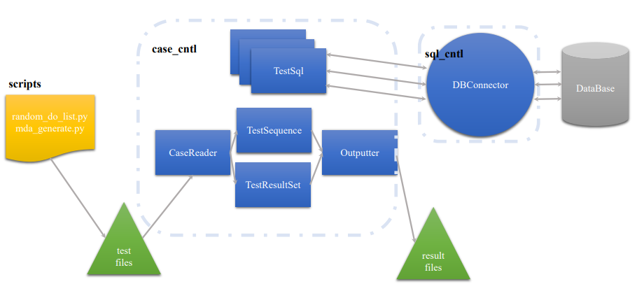

# 功能文档 

## 代码框架 

源代码编译运行后会生成三个可执行文件，分别为静态测试文件 `3ts_dbtest`、动态测试 文件 `3ts_dbtest_v2` 和键值数据库测试文件 `3ts_kvtest`，因此可以据此划分并阅读源代码。 

除核心源代码外，`src` 文件夹还包含一些脚本文件、配置文件和测试用例文件。其中脚 本文件 `auto_test_all.sh` 用于自动化全部测试用例，而 `auto_test.sh` 用于自动化某些测试 用例；配置文件 `CMakeLists.txt` 用于 `CMake` 项目构建；`do_test_list.txt` 包含一些测试用 例文件的列表；`t` 目录包含所有静态测试用例文件。

## 总体流程图 

以静态/动态测试为例，给出如下总体流程图。

## 静态测试

 静态测试包含 `33` 个测试用例，其测试文件在 `p` 文件夹下，不需要生成测试文件。源文件包括：`common.cc`、`case_cntl.cc`、`sql_cntl.cc`、`sqltest.cc` 以及对应的头文件，生成的可执行文件名为 `3ts_dbtest`。

### 源文件分析：

-  `common.cc` 包含常用的函数和操作，比如将给定的字符串按照分隔符进行分割以及移 除空白字符或者引号字符等；
-  `case_cntl.cc` 实现了测试用例控制功能，包含从测试文件中读取数据库配置、`sql` 语句 以及预期结果，验证处理实际结果和预期结果的区别，输出比对结果到指定文件夹等功能；
- `sql_cntl.cc` 涉及 `SQL` 控制或操作的代码。即实现了与 `ODBC` 数据库的接口功能。包 含设置数据库隔离级别、开始事务、执行增删改查等功能、处理 `SQL` 返回值并获取错 误信息、结束事务或回滚事务等功能。
- `sqltest.cc` 涉及 `SQL` 测试的代码，包含项目的主函数。该文件利用 `gflags` 库来实现命 令行参数解析，采用多线程编程，每个线程负责一组数据库语句的执行，并且通过子 线程不同的休眠时间实现程序代码按指定顺序运行。

### 重点类分析：

`CaseReader` 用于读取和解析测试用例；`TestResultSet` 用于表示测试结果集；`TxnSql` 与事务 `SQL` 操作相关；`TestSequence` 表示测试序列；`ResultHandler` 用 于处理测试结果；`Outputter` 用于格式化和输出测试结果。

###  重点函数分析：

 `ExecTestSequence` 用于执行一个指定的测试序列；`ExecAllTestSequence` 利用多线程执行所有测试序列。

## 动态测试 

动态测试需要通过 `python` 脚本文件动态生成测试文件。源文件包括:`common.cc`、`case_cntl_v2.cc`、`sql_cntl_v2.cc`、`sqltest_v2.cc`，生成的可执行文件名为 `3ts_dbtest_v2`。其中 `*_v2.cc` 为对应静态测试文件的另一个版本，大致功能相似。

较大的不同为动态测试中测试样例由 `python` 脚本文件生成，包含 `random_do_list.py`、 `mda_detect.py`、`mda_generate.py` 文件。其中 `random_do_list.py` 用于随机生成测试文件 列表；`mda_generate.py` 用于生成指定格式测试样例；`mda_detect.py`: 可能用于检测测试 结果是否出现异常现象。

### 源文件分析：

- `random_do_list.py` 基于预定义的操作集随机生成一系列数据库操作，此外还要确保 生成的操作列表不含任何非法模式。此脚本文件会生成 `do_test_list.txt` 文件，该文件包含不同的测试模式，即具体测试文件列表。 
- `mda_generate.py` 从 `do_test_list.txt` 文件中读取所需的操作模式（例如 `RW-RR` 等）， 针对每种操作模式生成一个测试用例文件，该文件包含初始化表、执行事务和验证的 `SQL` 语句。主要目的是为不同的操作模式自动生成数据库测试用例。 
- `mda_detect.py` 主要用于数据库事务的序列化调度检查。即读取事务，并构建一个图， 该图表示事务之间的依赖关系。然后，程序会检查这个图是否存在循环，从而判断事 务调度是否是序列化的。

## 键值数据库测试

 键值数据库测试源文件包括：`common.cc`、`case_cntl.cc`、`kv_cntl.cc` 和 `kvtest.cc` 文件， 生成的可执行文件名为 `3ts_kvtest`，其中 `kvtest.cc` 涉及键值数据库测试的代码。

## 功能扩展

即添加其他数据库测试结果，以 `MariaDB` 数据库为例。

**数据库连接** 在 `DBConnector` 类中添加 `MariaDB` 的连接代码，需要使用 `MariaDB` 的 `C` `API` 或其他库来实现。此外还需要安装和配置必要的 `MariaDB` 客户端库和头文件，确保它 们能在项目中被正确引用。

**配置文件** 重新配置文件来指定数据库连接信息（例如，数据库主机、用户名、密码等），确保添加对 `MariaDB` 相关配置的支持。 

**`SQL` 语法** 虽然 `MariaDB` 基本上与 `MySQL`兼容，但还是可能存在一些语法上的差异。因此需要确保 `SQL` 语句和查询对 `MariaDB` 兼容。 

**功能测试** 根据项目的结构和代码，需要在 `CaseReader` 或 `ResultHandler` 类中添加或修改 代码，以处理 `MariaDB` 的特定测试和结果。并且需要考虑添加 `MariaDB` 特有的功能和事务测试。 

**错误处理** 更新错误处理代码以处理 `MariaDB` 特定的错误和异常。 

**文档说明** 更新项目的 `README` 或其他文档，添加关于如何配置和运行针对 `MariaDB` 的 测试的说明。